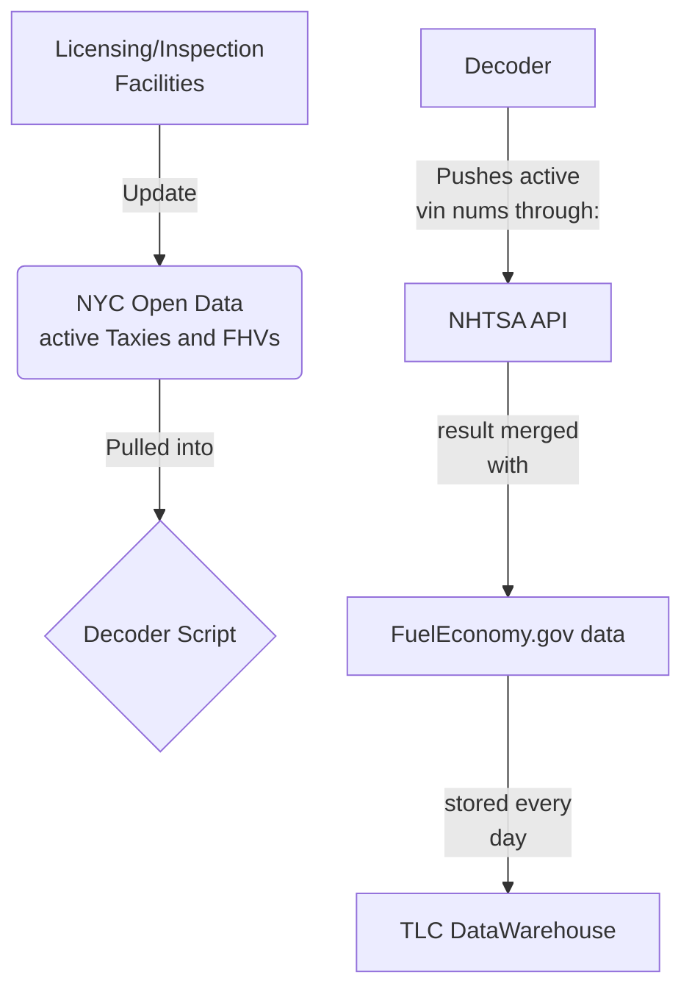

# pyDecoder

This vin decoder tracks active vehicles in the TLC fleet and removes the ones that are not active anymore from the database. Because of the lack of a unique identifier match between the fuel dataset that gets pulled from the fueleconomy.gov and TLC database, a fuzzymerge algorythm looks for and grades matches by multiple data points before joining these tables. Result is a clean dataset that gets used by the agency' analysts. 

# Requirements

## Business Requirements

1. Who is the requestor(s) of this project

    - TLC Policy Division
    - TLC Executive Office

2. What problem the project aims to solve

The project is a response to the challenges that the data team is facing day-to-day when working with the existing infrastructure. We work in a fast-paced environment and must be able to quickly answer data questions coming from within and outside of the agency. One of those questions is how many active vehicles do we have, what are those vehicles, who many are EVs and what are their mpgs? Some of that info is not available to us internally. We needed to build an algo to get that data.   

3. Timeframes (start date, deadline...)

Start: 05-01-2019, deadline: 06-01-2019

## Technical Requirements

1. Technology used (programming stack, other software like Tableau?)

    - MS T-SQL 
    - SQL Server 
    - SSMS 
    - Python 
    - R
    - NYC OPEN DATA API

2. Permissions/access to folders required and where obtained

There are multiple permissions required for this project.

    1.AZURE multifactor auth provided by IT
    2.Access to the Job Scheduler 
    3.Persmissons to create and run stored procedures
    4.Access to the Open Data Portal

3. Databases/servers used (internal and external data sources)

    1. MS SQL Server
    2. TLC Licensing Open Data
    3. NHTSA Federal API

4. Code location

    1. Internal TLC server
    2. Azure Git Repos

## Personnel Requirements

| Name | Role | Email |
|--|--|--|
| NIkita Voevodin | Product Owner/Developer | tbd@tlc.nyc.gov |
| hidden | Product Owner | tbd@tlc.nyc.gov |
| hidden | QA | tbd@tlc.nyc.gov |

# Development Workflow

A Detailed description of how the project/requirement was completed. A new reader should be able to understand and follow the workflow that you outline here.

This is a big project and it had a few major stages:

## Internal Planning

- Discussions about the tech stack
- Discussions about available resources
- Discussions about the needs (tables, views, most requested metrics, usage, benefits)
- Discussions about the roles
- Timelines and milestones

## Permissons and Infrastructure Provisioning

- Presentation to the Deputy Commissioner of Policy/Data
- Prioritization vote with all the departments heads
- Request for resources to the procurement team 
- Prototyping and tests

## Development

- This prototype was developed in 3 days
- QA testing (QA at IT + data analysts at the data team)
- Job scheduling
- Documentation

## Maintenance and Additions

- Creation of pivot views
- Access to other departments
- Linking the results to BI tools

# Use Workflow

Minimal use example (Step by step). If not applicable - explain why.

### Usecases

In 2018 TLC imposed a cap on how many for-hire licenses it can have active. That policy gets revieved by the policy/data division every year and a report/recommendation is produced. The report either allows for more vehicles or upholds the cap. The report can create exception such as allowing n number of electric or wheelchair accessible vehicle licenses to be permitted. This script is the backbone for these recommendations. It allows for accurate account of, for example, electric vehicles in our fleet. 

## Decoder Data Flow

# Data Classification

Describe nature of data. Is it sensitive or not. Public or not. Can/should/will be released or not ...

*Please refer to the standardization_work.pptx document for my rules and recomendations for this project.*

# Authentication

TLC Employees authenticate to the Azure Server using their network email address and password. Multi-factor authentication is enabled for these users. Authentication is provided and managed by IT. An Admin can create roles for devs and users.

